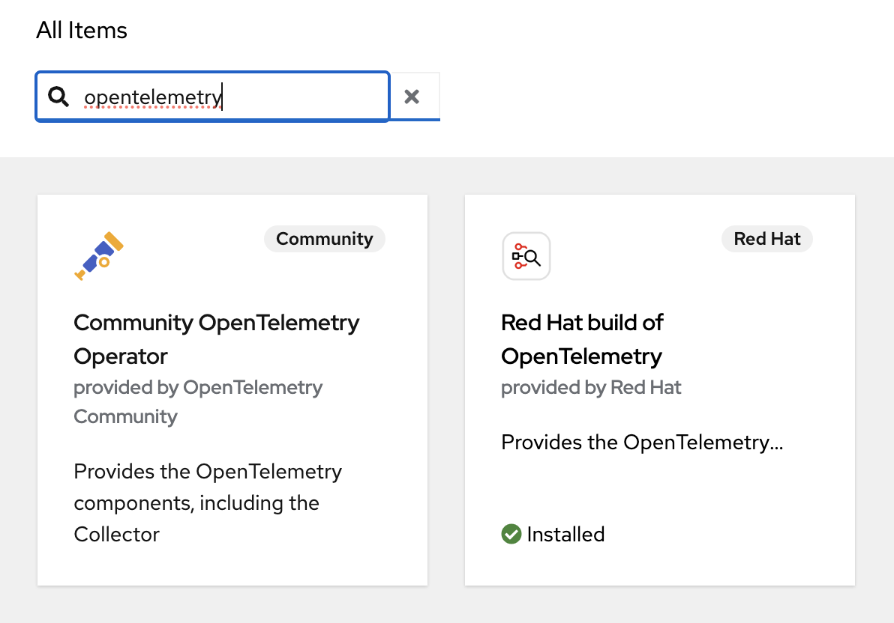
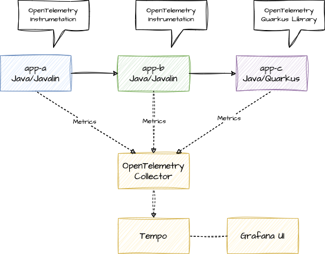
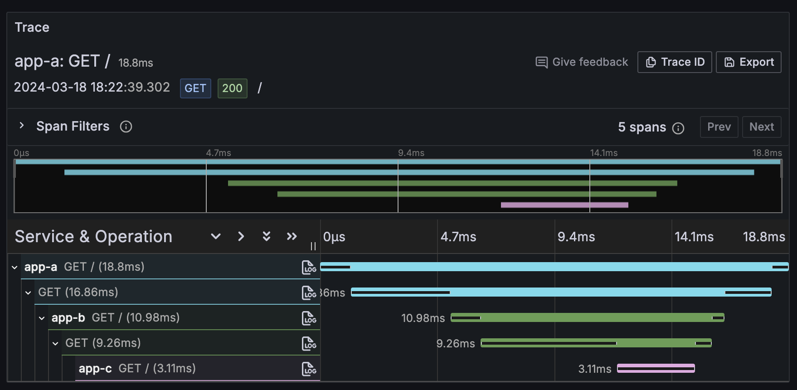

# Distributed Tracing with OpenTelemetry

Simple example of distributed tracing with OpenTelemetry. Tracing backend Grafana Cloud, apps running on OpenShift with OpenTelemetry Operator for instrumenting the apps and collecting the traces.

We have the following apps:


Each app responds with it's name and we do a downstream service call, so app-a calls app-b calls app-c, adding the response of the downstream call to the output. So calling the app-a endpoint should return:

> App A <- App B <- App C

## Setup Grafana Tempo

One option is using the free tier of Grafana cloud; free tier is enough for testing, if no sensitive data is transferred. Alternatively, [setup Grafana / Tempo stack on OpenShift](https://docs.openshift.com/container-platform/4.14/distr_tracing/distr_tracing_tempo/distr-tracing-tempo-installing.html).

Make endpoint data of Tempo available via environment variables:

```bash
export TEMPO_URL=<tempourl>
export TEMPO_USER=<userid>
export TEMPO_APIKEY=<apikey>
```

## Configure OpenShift

### Setup OpenTelemetry

In OpenShift, install the **Red Hat build of OpenTelemetry** operator from Operator Hub and accept the defaults.



### Create new project

```bash
oc new-project demo
```

### Create collector instance

Encode the token for Tempo and set it as environment variable:

```bash
export TEMPO_TOKEN=`echo -n "$TEMPO_USER:$TEMPO_APIKEY" | base64`
```

Then create the Collector:

```bash
cat <<EOF |oc apply -f -
apiVersion: opentelemetry.io/v1alpha1
kind: OpenTelemetryCollector
metadata:
  name: otel
spec:
  config: |
    receivers:
      otlp:
        protocols:
          grpc:
          http:
    processors:
      batch:
    exporters:
      logging:
        loglevel: info
      otlp:
        endpoint: ${TEMPO_URL}
        headers:
          authorization: Basic ${TEMPO_TOKEN}
    service:
      pipelines:
        traces:
          receivers: [otlp]
          processors: [batch]
          exporters: [logging,otlp]
  mode: deployment
  resources: {}
  targetAllocator: {}
EOF
```

We're using the **deployment** mode here, other options like **sidecar** are also available. Check the status of the deployment

```bash
oc get deploy -w
``` 

When ready, have a look at the logs with 

```bash
oc logs deployment/otel-collector
```

## Testing with apps

### Deploy sample apps

```bash
oc apply -k k8s/base
```

### Test sample app

```bash
export ROUTE=http://$(oc get route app-a -o jsonpath='{.spec.host}')
curl $ROUTE
```

### Grafana traces

Got to Grafana Dashboard and navigate:  
Explore -> grafanacloud-\<username\>-traces -> Query type "Search"

No traces to find. Now we want to change that so we have metrics flowing to Grafana / Tempo:



Apply the kustomizations for tracing - the instrumentation resources, the annotations to trigger the instrumentation in app-a and app-b and the change of the sampler ratio of the Quarkus app-c from 0% to 100%.

```bash
oc apply -k k8s/overlays/trace
```

If you inspect the pods of app-a and app-b, you can see that the Java agent for the instrumentation is added via **JAVA_TOOL_OPTIONS**. An init container copied the javaagent.jar to the pod volume. app-c has no Java agent, as the Quarkus app itself sends the metrics to the collector and we haven't applied the instrumentation to app-c.

Make some calls to the app-a endpoint and check again Grafana. Now you should be able to see the traces for the apps:


