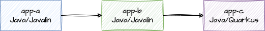
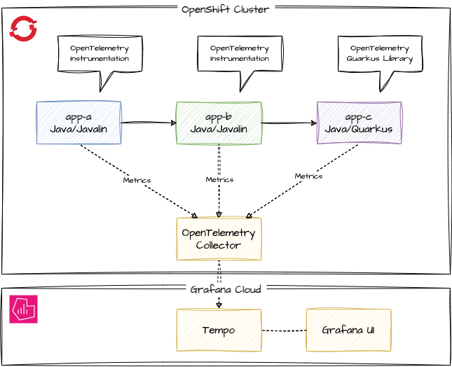
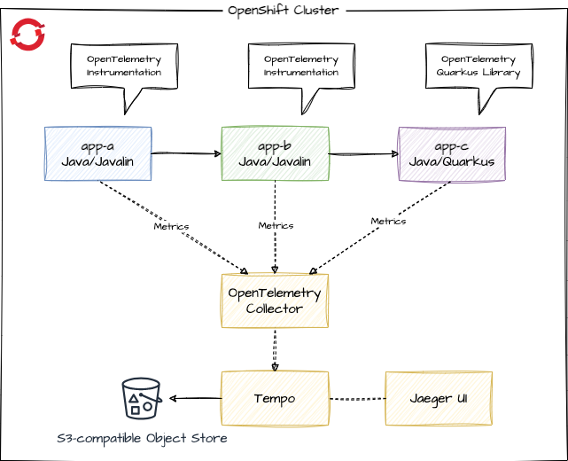
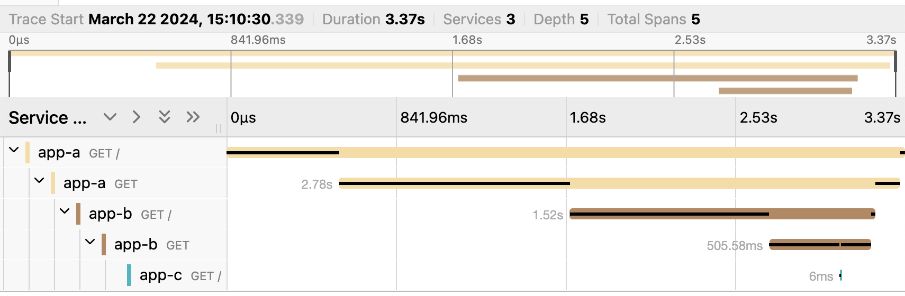

# Distributed Tracing with OpenTelemetry

Simple example of distributed tracing with OpenTelemetry. Tracing backend Tempo/Grafana (Grafana Cloud) or Tempo/Jaeger UI (Tempo Operator on OpenShift), apps running on OpenShift with OpenTelemetry Operator for instrumenting the apps and collecting the traces.

We have the following apps:



Each app responds with it's name and we do a downstream service call, so app-a calls app-b calls app-c, adding the response of the downstream call to the output. So calling the app-a endpoint should return:

> App A <- App B <- App C

## Setup Tempo

### _Option A:_ Grafana Cloud

One option is using the free tier of Grafana Cloud; free tier is enough for testing, if no sensitive data is transferred. Alternatively, [setup Distributed Tracing Tempo stack on OpenShift](https://docs.openshift.com/container-platform/4.15/observability/distr_tracing/distr_tracing_tempo/distr-tracing-tempo-installing.html) (Option B).

### _Option B:_ Distributed Tracing stack on OpenShift

#### Step 1: Setup storage

[MinIO instructions](https://min.io/docs/minio/kubernetes/upstream/index.html)

```bash
oc create -f k8s/infra/minio.yml
```

Do not use this MinIO configuration for production workloads!

Check the Route for your MinIO installation and open the console route in your browser. Login with minioadmin / minioadmin, create a bucket and an API key. For simplicity reasons create a bucket "tempostorage" and an access key "tempostorage" with secret key "tempostorage". Again, do not do that for production workloads.

#### Step 2: Tempo operator

```bash
oc create -f k8s/infra/tempo-operator.yml
```

When installed and ready, create a new project for the tempo stack instance with the secret for the MinIO bucket from Step 1 and the tempostack instance.

```bash
oc new-project tempostack
oc create -f k8s/infra/minio-secret.yml
oc create -f k8s/infra/tempostack.yml
```

When all pods are running, check the Route `oc get route` and open in the Browser (Jaeger UI).

## Setup OpenTelemetry and sample apps

### Setup OpenTelemetry

Login to your OpenShift cluster and install the OpenTelemetry operator:

```bash
oc create -f k8s/infra/opentelemetry-operator.yml
```

Alternatively install via OpenShift UI the **Red Hat build of OpenTelemetry** operator from Operator Hub and accept the defaults.

### Create new project

```bash
oc new-project demo
```

### Create collector instance

#### _Option A:_ Collector sending to Grafana Cloud

Make endpoint data of Tempo available via environment variables:

```bash
export TEMPO_URL=<tempourl>
export TEMPO_USER=<userid>
export TEMPO_APIKEY=<apikey>
export TEMPO_TOKEN=`echo -n "$TEMPO_USER:$TEMPO_APIKEY" | base64`
```

Then create the Collector:

```bash
envsubst < k8s/infra/grafanacloud-collector.yml | oc apply -f -
```

If you don't have *envsubst*, use *yq* or edit the file to set the Tempo URL and Token before applying.

#### _Option B:_ Collector sending to Tempostack on OpenShift

```bash
oc create -f k8s/infra/tempostack-collector.yml
```

#### Checking the state of the collector

We're using the **deployment** mode of the collector here, other options like **sidecar** are also available. 

Check the status of the deployment:

```bash
oc get deploy -w
``` 

When ready, have a look at the logs with 

```bash
oc logs deployment/otel-collector
```

## Testing with apps

### Deploy sample apps

```bash
oc apply -k k8s/base
```

### Test sample app

```bash
export ROUTE=http://$(oc get route app-a -o jsonpath='{.spec.host}')
curl $ROUTE
```

### Checking the traces

#### _Option A:_ Grafana Cloud

Got to Grafana Dashboard and navigate:  
Explore -> grafanacloud-\<username\>-traces -> Query type "Search"

No traces to find. Now we want to change that so we have metrics flowing to Grafana / Tempo:



Apply the kustomizations for tracing - the instrumentation resources, the annotations to trigger the instrumentation in app-a and app-b and the change of the sampler ratio of the Quarkus app-c from 0% to 100%.

```bash
oc apply -k k8s/overlays/trace
```

If you inspect the pods of app-a and app-b, you can see that the Java agent for the instrumentation is added via **JAVA_TOOL_OPTIONS**. An init container copied the javaagent.jar to the pod volume. app-c has no Java agent, as the Quarkus app itself sends the metrics to the collector and we haven't applied the instrumentation to app-c. 

Hint: If the javaagent is missing but the annotations are there, simply delete the pods so they're recreated.

Make some calls to the app-a endpoint and check again Grafana. Now you should be able to see the traces for the apps:


#### _Option B:_ Tempostack Jaeger UI

With the Tempo stack operator comes Jaeger UI (you could also configure Grafana UI). Our desired flow of the metrics is:



You can find the URL to Jaeger UI with:

```bash
oc get route -n tempostack
```

If not done already, apply the kustomizations for the tracing:

```bash
oc apply -k k8s/overlays/trace
```

Now call the app-a endpoint to generate some traces, open the Jeager UI (`oc get route -n tempostack`) in a Browser, select app-a and click on "Find traces". You should see the distributed tracing information:


