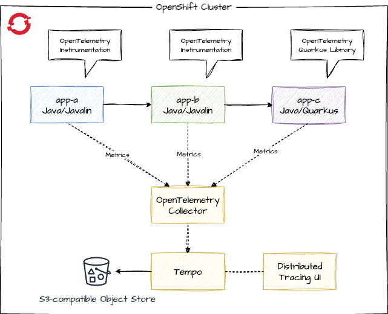
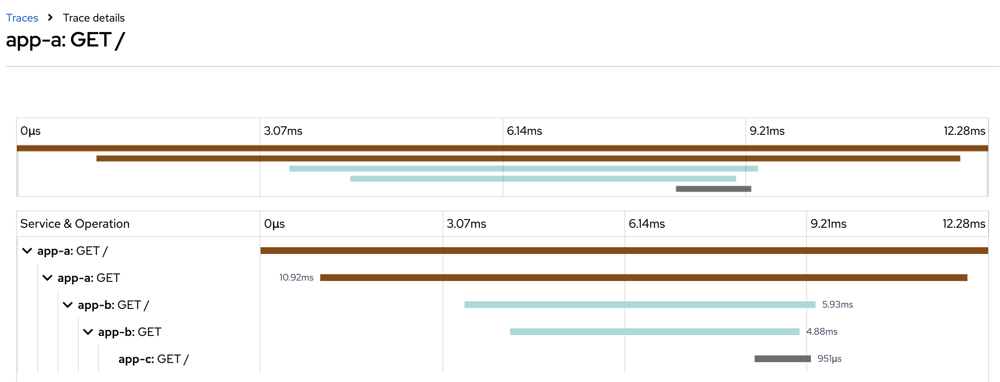

# Distributed Tracing with OpenTelemetry

Simple example of distributed tracing with OpenTelemetry. Tracing backend Tempo/Grafana (Grafana Cloud) or Tempo/Jaeger UI (Tempo Operator on OpenShift), apps running on OpenShift with OpenTelemetry Operator for instrumenting the apps and collecting the traces.

We have the following apps:


Each app responds with it's name and we do a downstream service call, so app-a calls app-b calls app-c, adding the response of the downstream call to the output. So calling the app-a endpoint should return:

> App A <- App B <- App C

## Setup the Tempo stack

### Step 1: Operators

#### Install the Tempo operator

```bash
oc create -f k8s/infra/tempo-operator.yml
```

#### Install the Cluster Observability Operator

In the web console, got to **Operators -> OperatorHub** und install the **Cluster Observability Operator** (accept defaults). When installed, switch to the tab **UIPlugin** and create the UI plugin for distributed tracing:

```yaml
apiVersion: observability.openshift.io/v1alpha1
kind: UIPlugin
metadata:
  name: distributed-tracing
spec:
  type: DistributedTracing
```

### Step 2: Setup storage and TempoStack

Prerequisite: **ODF is installed** on OpenShift. If not, please install or use MinIO as alternative (instructions on the bottom of the page).

#### Storage

Create a bucketclaim

```bash
oc create -f k8s/infra/bucketclaim.yml
```

Then read the generated access keys and and export them as environment variables:

```bash
export S3_ENDPOINT="http://s3.openshift-storage.svc"
export AWS_ACCESS_KEY_ID=$(oc get secret tempostorage -n tempostack -o jsonpath='{.data.AWS_ACCESS_KEY_ID}' | base64 --decode)
export AWS_SECRET_ACCESS_KEY=$(oc get secret tempostorage -n tempostack -o jsonpath='{.data.AWS_SECRET_ACCESS_KEY}' | base64 --decode)
```

### TempoStack

Now create the Tempo stack: 

```bash
envsubst < k8s/infra/tempostack.yml | oc apply -f -
```

If you don't have _envsubst_, replace the values manually in _tempostack.yml_.

## Setup OpenTelemetry and sample apps

### Setup OpenTelemetry

Next install the OpenTelemetry operator:

```bash
oc create -f k8s/infra/opentelemetry-operator.yml
```

Alternatively install via OpenShift UI the **Red Hat build of OpenTelemetry** operator from Operator Hub and accept the defaults.

### Create new project

```bash
oc new-project instapps
```

### Create collector instance

#### Collector sending to Tempostack on OpenShift

```bash
oc create -f k8s/infra/tempostack-collector.yml
```

#### Checking the state of the collector

We're using the **deployment** mode of the collector here, other options like **sidecar** are also available. 

Check the status of the deployment:

```bash
oc get deploy -w
``` 

When ready, have a look at the logs with 

```bash
oc logs deployment/otel-collector
```

## Testing with apps

### Deploy sample apps

```bash
oc apply -k k8s/base
```

### Test sample app

```bash
export ROUTE=http://$(oc get route app-a -o jsonpath='{.spec.host}')
curl $ROUTE
```

### Checking the traces with Distributed Tracing UI

This is the how our distributed tracing should look now:



Apply the kustomizations for tracing - the instrumentation resources, the annotations to trigger the instrumentation in app-a and app-b and the change of the sampler ratio of the Quarkus app-c from 0% to 100%.

```bash
oc apply -k k8s/overlays/trace
```

If you inspect the pods of app-a and app-b, you can see that the Java agent for the instrumentation is added via **JAVA_TOOL_OPTIONS**. An init container copied the javaagent.jar to the pod volume. app-c has no Java agent, as the Quarkus app itself sends the metrics to the collector and we haven't applied the instrumentation to app-c. 

Hint: If the javaagent is missing but the annotations are there, simply delete the pods so they're recreated.

Now call the app-a endpoint to generate some traces, in **OpenShift**, navigate to ***Observe -> Traces***. Select the tempo instance "tempostack" and the tenant "instapps.". You should see the distributed tracing information:



***If you don't see any traces:***
* wait a few seconds and try again (reload), the observability does not work in realtime
* check the pods of app-a and app-b, if the instrumentation has been applied (`oc describe pod app-a-xxxx`), if not, delete the pod, it's recreated and now the instrumentation should be there
* check the logs of the OpenTelementry collector and maybe the TempoStack to find the cause of the problem

## Grafana Cloud

Now your company wants to evaluate, if it should use Grafana Cloud instead of the TempoStack.


If you don't have an account yet, for testing you could register for the free tier of Grafana Cloud. Free tier is enough for testing, if no sensitive data is transferred.

Login to Grafana Cloud and setup an instance. Make note of the endpoint, user, api key and token.

### Collector sending to Grafana Cloud

Make endpoint data of Tempo available via environment variables:

```bash
export TEMPO_URL=<tempourl>
export TEMPO_USER=<userid>
export TEMPO_APIKEY=<apikey>
export TEMPO_TOKEN=`echo -n "$TEMPO_USER:$TEMPO_APIKEY" | base64`
```

Replace the collector, that send telemetry data to the TempoStack by a new collector that send the data into the Grafana Cloud:

```bash
oc delete -f k8s/infra/tempostack-collector.yml
envsubst < k8s/infra/grafanacloud-collector.yml | oc apply -f -
```

If you don't have *envsubst*, use *yq* or edit the file to set the Tempo URL and Token before applying.

### Grafana Cloud

Again, make some **curl** calls to your apps API endpoint to create some telemetry data. Then open the Grafana Dashboard and navigate to:  
Explore -> grafanacloud-\<username\>-traces -> Query type "Search".


## Service Mesh

We used OpenTelemetry instrumentation and SDK in our apps, to create and send the tracing data to the OpenTelementry collector. Now we configure OpenShift Service Mesh 2 to do that. It works the same with Service Mesh 3, but as many OpenShift users want to replace the **deprecated Jaeger** but for now not upgrade Service Mesh to version 3, we will show the combination of Service Mesh 2 with the Distributed Tracing Tempo stack and OpenTelemetry here.

### Operator install

Install in order: 
* Kiali  
Namespace: openshift-operators
* Red Hat OpenShift Service Mesh 2  
Namespace: openshift-operators

### Setup Service Mesh

First, create the **meshapps** namespace with the tempostack collector:

```bash
oc create -f k8s/infra/servicemesh2/tempostack-collector.yml
```

Then create the ServiceMeshControlPlane with the ServiceMeshMemberRoll:

```bash
oc create -f k8s/infra/servicemesh2/mesh-resources.yml
```

### Apps

Create the apps in the **meshapps** project:

```bash
oc project meshapps
oc apply -k k8s/meshapps
```

Verify that the pods are created and show in the "READY" column not 1/1 but 2/2. In each pod there are 2 containers, the app container and the Envoy sidecar.

### Check tracing

An Istio Ingress-Gateway has been set up. Get the route to the gateway with:

```bash
oc get route istio-ingressgateway -n istio-system
```

Then call the Ingress gateway on path **/mesh-app-a** to generate some traffic.

```bash
while true; do curl <GATEWAY>/mesh-app-a; sleep 5; done;
```

Open the Distributed Tracing UI in OpenShift, select the "tempostack" instance and the "meshapps" tenant to see the traces.

## MinIO storage option

If you don't want to use ODF, you can use MinIO.

[MinIO instructions](https://min.io/docs/minio/kubernetes/upstream/index.html)

```bash
oc create -f k8s/infra/minio.yml
```

Do not use this MinIO configuration for production workloads!

Check the Route for your MinIO installation and open the console route in your browser. Login with minioadmin / minioadmin, create a bucket and an API key. For simplicity reasons create a bucket "tempostorage" and an access key "tempostorage" with secret key "tempostorage". Again, do not do that for production workloads.

Then create the TempoStack:

```bash
oc new-project tempostack
export S3_ENDPOINT="http://minio.minio.svc:9000"
export AWS_ACCESS_KEY_ID="tempostorage"
export AWS_SECRET_ACCESS_KEY="tempostorage"
envsubst < k8s/infra/tempostack.yml | oc apply -f -
```